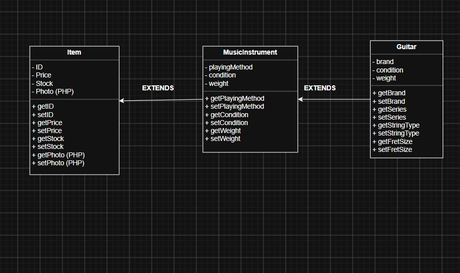
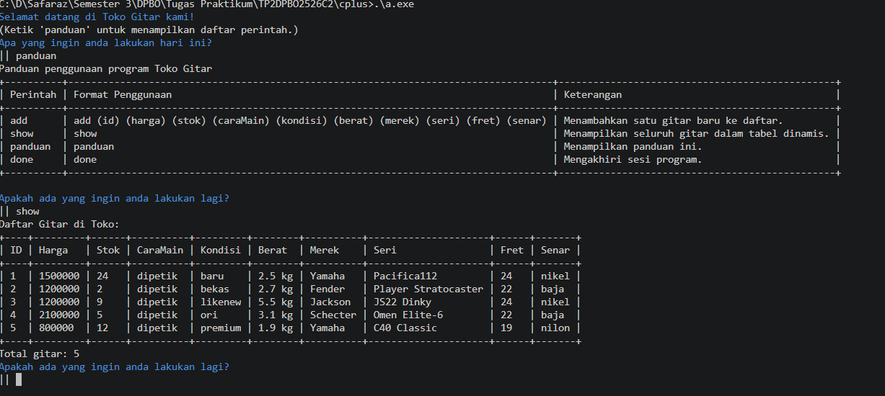
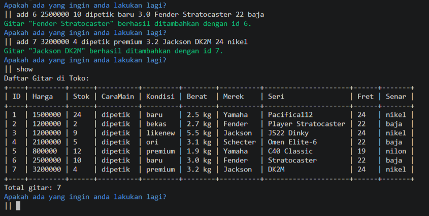
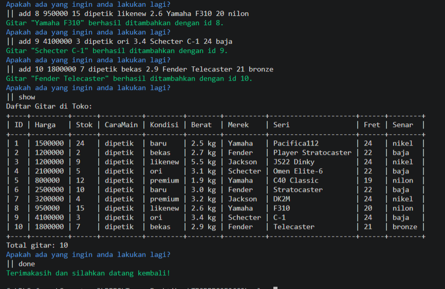
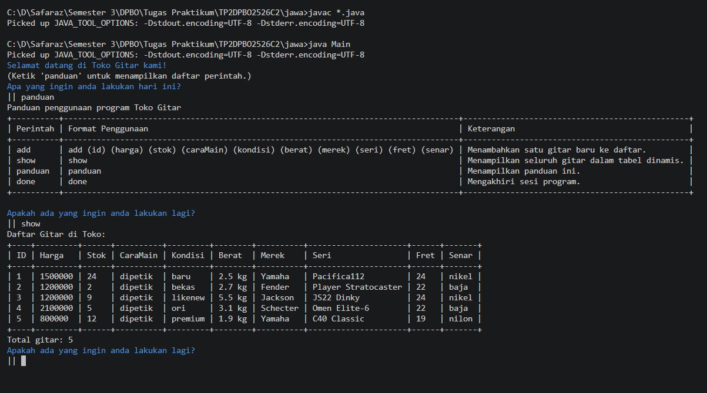
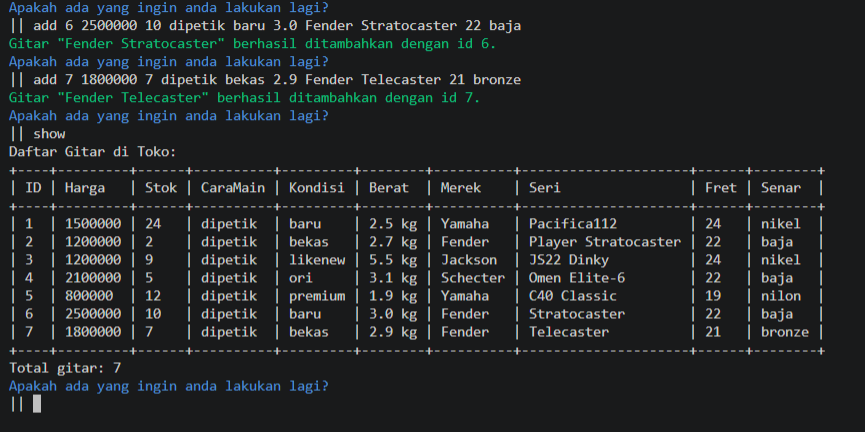
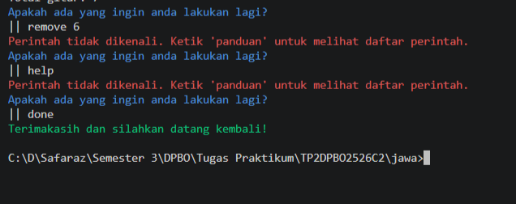
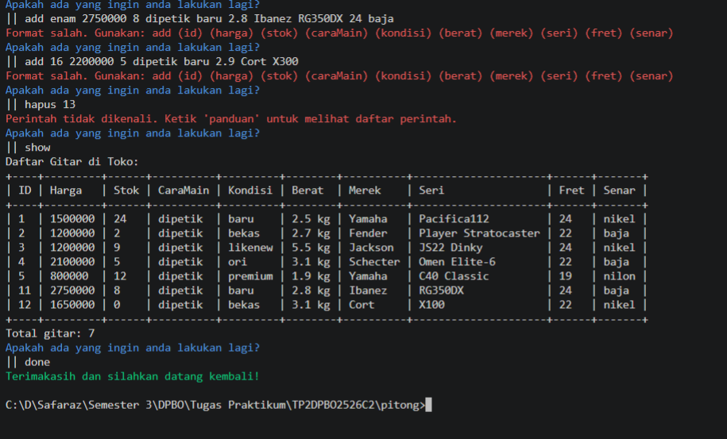
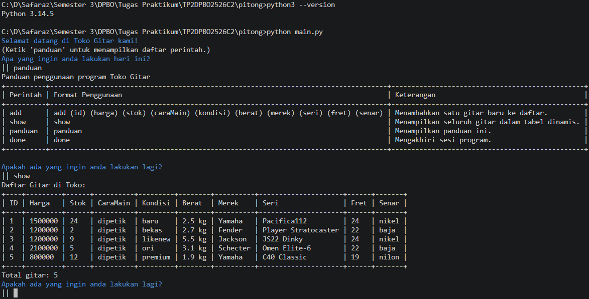
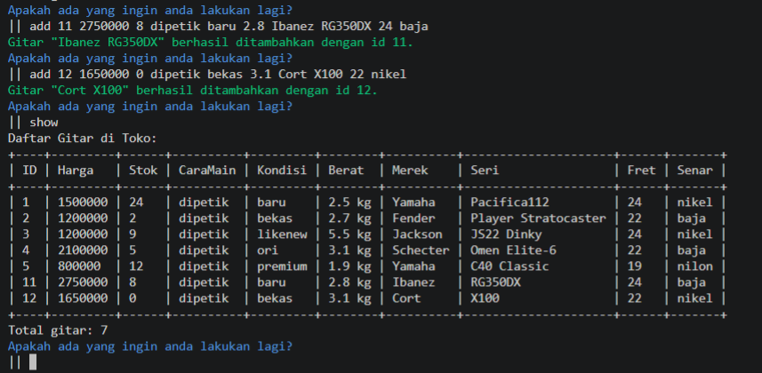

# Janji
Saya Faridchi Trianda Safaraz dengan NIM 2506827 mengerjakan Tugas Praktikum 2 pada Mata Kuliah Desain dan Pemrograman Berorientasi Objek (DPBO) untuk keberkahan-Nya maka saya tidak melakukan kecurangan seperti yang telah dispesifikasikan. Aamiin

# Struktur File
```
TP2DPBO2526C2
├── Cpp/
│   ├── Program/
│   │   ├── Item.cpp
│   │   ├── MusicInstrument.cpp
│   │   ├── Guitar.cpp
│   │   └── main.cpp
│   │
│   └── Dokumentasi/
│       ├── cpp1.png
│       ├── cpp2.png
│       └── cpp3.png
│
├── Java/
│   ├── Program/
│   │   ├── Item.java
│   │   ├── MusicInstrument.java
│   │   ├── Guitar.java
│   │   └── Main.java
│   │
│   └── Dokumentasi/
│       ├── java1.png
│       ├── java2.png
│       └── java3.png
│
├── Python/
│   ├── Program/
│   │   ├── Item.py
│   │   ├── MusicInstrument.py
│   │   ├── Guitar.py
│   │   └── main.py
│   │
│   └── Dokumentasi/
│       ├── py1.png
│       ├── py2.png
│       └── py3.png
│
├── PHP/
│   ├── Program/
│   │   ├── Item.php
│   │   ├── MusicInstrument.php
│   │   ├── Guitar.php
│   │   ├── index.php
│   │   └── images (folder images untuk tabel)
│   │
│   └── Dokumentasi/
│       ├── php1.png
│       ├── php2.png
│       ├── php3.png
│       └── php4.png
│
├── Diagram.png
└── README.md
```

# Diagram


# Penjelasan Desain
Terdapat __3__ class pada desain yang saya buat, yaitu __Item__, __MusicInstrument__, dan __Guitar__. Program ini menerapkan __Multilevel Inheritance__ dengan __Item__ sebagai class dasar, kemudian __MusicInstrument__ sebagai turunan dari produk barang, dan terakhir __Guitar__ sebagai class spesifik dari __MusicInstrument__. Susunan inheritance tersebut dipilih karena class Item menyimpan atribut yang paling umum di antara ketiganya, sedangkan class __Guitar__ memiliki atribut yang paling khusus. Pada setiap class, terdapat getter dan setter untuk setiap atribut. Berikut atribut dari masing-masing class:
- Item:
  - ID
  - Price
  - Stock
  - Photo (khusus PHP)
- MusicInstrument
  - PlayingMethod
  - Condition
  - Weight
- Guitar
  - Brand
  - Series
  - FretSize
  - StringType

# Flow Code & Panduan Penggunaan
Alur program atau flow code saya terlihat seperti di bawah :
1. __Inisialisasi data awal__
: Program mulai, menampilkan pesan selamat datang. Lalu langsung membuat 5 objek Guitar hardcode (Yamaha, Fender, Jackson, Schecter) dan dimasukkan ke dalam list/vector penampung.
2. __Loop membaca perintah__
: Program masuk ke perulangan (while) yang terus membaca satu baris perintah dari input, sampai user mengetik 'done' atau file input habis (EOF).
3. __Parsing & case-insensitive__
: Kata pertama di setiap baris (misalnya 'add', 'show', 'panduan', 'done') diambil dan diubah jadi huruf kecil semua, supaya perintah tetap dikenali walau user ketik ADD, Add, atau add.
4. __Eksekusi sesuai perintah__
: kalo add, ambil sisa kata di baris itu, validasi apakah jumlah dan tipe datanya sesuai (angka untuk id/harga/stok/berat/fret), lalu buat objek Guitar baru dan masukkan ke list. kalo show, cek dulu apakah list kosong; kalau kosong tampilkan pesan error, kalau ada isi tampilkan tabel dinamis. terakhir panduan, tampilkan tabel bantuan berisi daftar perintah.
5. __Tabel dinamis__
: Setiap objek Guitar diubah jadi satu baris data lewat getter-getternya (guitarToRow), lalu lebar setiap kolom dihitung otomatis berdasarkan data terpanjang di kolom itu (termasuk headernya), sehingga tabel selalu rapi berapapun panjang datanya.
6. __Mengakhiri program__
: Kalau user ketik 'done', flag pengulangan diset false sehingga loop berhenti, lalu program mencetak pesan terima kasih dan keluar. Untuk versi PHP (web), 'done' hanya menampilkan pesan karena halaman web tidak benar-benar 'exit', state tetap tersimpan di session sampai browser ditutup atau session dihapus.

Program menampilkan panduan berupa tabel yang bisa dipanggil dengan mengetik `panduan`. Berikut isi panduannya:

### Versi C++ / Python / Java
```
Panduan penggunaan program Toko Gitar
+----------+------------------------------------------------------------------------------------+------------------------------------------------+
| Perintah | Format Penggunaan                                                                  | Keterangan                                     |
+----------+------------------------------------------------------------------------------------+------------------------------------------------+
| add      | add (id) (harga) (stok) (caraMain) (kondisi) (berat) (merek) (seri) (fret) (senar) | Menambahkan satu gitar baru ke daftar.         |
| show     | show                                                                               | Menampilkan seluruh gitar dalam tabel dinamis. |
| panduan  | panduan                                                                            | Menampilkan panduan ini.                       |
| done     | done                                                                               | Mengakhiri sesi program.                       |
+----------+------------------------------------------------------------------------------------+------------------------------------------------+
```

### Versi PHP (dengan atribut foto)
```
Panduan penggunaan program Toko Gitar
+----------+-------------------------------------------------------------------------------------------+------------------------------------------------+
| Perintah | Format Penggunaan                                                                         | Keterangan                                     |
+----------+-------------------------------------------------------------------------------------------+------------------------------------------------+
| add      | add (id) (harga) (stok) (caraMain) (kondisi) (berat) (merek) (seri) (fret) (senar) (foto) | Menambahkan satu gitar baru ke daftar.         |
| show     | show                                                                                      | Menampilkan seluruh gitar dalam tabel dinamis. |
| panduan  | panduan                                                                                   | Menampilkan panduan ini.                       |
| done     | done                                                                                      | Mengakhiri sesi program.                       |
+----------+-------------------------------------------------------------------------------------------+------------------------------------------------+
```
Catatan: kolom `(foto)` diisi dengan path/nama file gambar gitar, contoh: `images/fender-stratocaster.jpg`. File gambarnya sendiri ditaruh di folder `images/` pada `PHP/Program/`.

# Dokumentasi

## C++
<div>
    
    
    
</div>

## JAVA
<div>
    
    
    
</div>

## PYTHON
<div>
    
    
    
</div>

## PHP
<div>
    
    
    
</div>